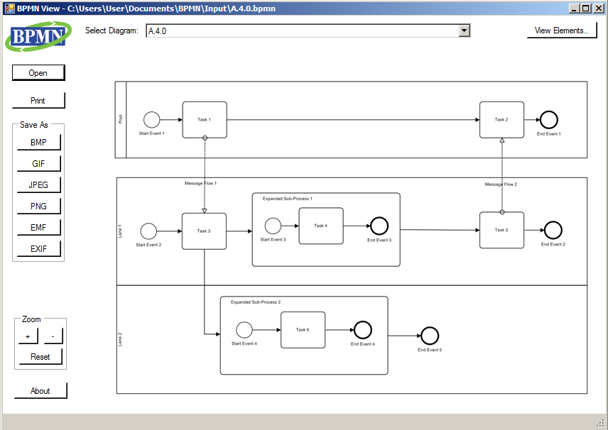

[](https://ci.appveyor.com/project/bzinchenko/bpmnview)
[](https://opensource.org/licenses/MIT) [](https://app.fossa.io/projects/git%2Bgithub.com%2Fbzinchenko%2Fbpmnview?ref=badge_shield)

# BPMN View
A simple free tool to view and print business process diagrams in a popular BPMN format. 

* Full conformance to the latest version of [BPMN 2.0 specification by OMG](http://www.bpmn.org/).
* Import models from all [major BPM vendors](http://bpmn-miwg.github.io/bpmn-miwg-tools/)
* Strict validation of the model according to BPMN specification.
* Arbitrary scaling and zooming view of most complex diagrams.
* Support of raster and vector image output.
* Batch processing of multiple BPMN files.
* Simple API to create new BPMN models.
* 100% Microsoft .NET managed solution.
* Loyal open source license for private and commercial use.
 
Try it yourself!
* Download one-click [setup for Windows](https://github.com/bzinchenko/bpmnview/blob/master/Setup/BPMNView_Setup.zip).
* Download pre-built [binary package](https://github.com/bzinchenko/bpmnview/blob/master/Setup/BPMNView_Sources.zip).
* Clone project repository and build it with Microsoft Visual Studio.
* Test it on files from [offcial BPMN test suite](https://github.com/bpmn-miwg/bpmn-miwg-test-suite).
* Build your own open source or commercial solution based on this code.
 


## Code example to create diagram image

Jump start your BPMN capable solution in minutes!

Sample code to read BPMN file and save it as an image:

```csharp
Model model = BPMN.Model.Read("B.2.0.bpmn");
Image img = model.GetImage(0, 2.0f);
img.Save("B.2.0.png", ImageFormat.Png);
```

Below is the result:


## Code example to create new diagram

Sample code to create a new BPMN model and write it to file:

```csharp
    public static bool Create(string fileName)
    {
      Editor editor = new Editor();
      editor.Create("BPMN Model", "User");

      string id1 = editor.AddEvent(null, null, "Start Event", EventType.Start, EventTrigger.None, EventRole.None);
      string id2 = editor.AddActivity(null, "Task 1", ActivityType.Task, ActivityMarker.None, TaskType.User, null);
      string id3 = editor.AddActivity(null, "Task 2", ActivityType.Task, ActivityMarker.None, TaskType.Manual, null);
      string id4 = editor.AddActivity(null, "Task 3", ActivityType.Task, ActivityMarker.None, TaskType.Service, null);
      string id5 = editor.AddEvent(null, null, "End Event", EventType.End, EventTrigger.None, EventRole.None);
      string id7 = editor.AddFlow(null, null, id1, id2, null, FlowType.Sequence, null, false, FlowDirection.None);
      string id8 = editor.AddFlow(null, null, id2, id3, null, FlowType.Sequence, null, false, FlowDirection.None);
      string id9 = editor.AddFlow(null, null, id3, id4, null, FlowType.Sequence, null, false, FlowDirection.None);
      string id10 = editor.AddFlow(null, null, id4, id5, null, FlowType.Sequence, null, false, FlowDirection.None);

      string id = editor.AddDiagram("Test 1", 96);

      Shape shape = new Shape();
      Rectangle rect = new Rectangle(10, 10, 30, 30);
      shape.Bounds = new List<Rectangle>();
      shape.Bounds.Add(rect);
      shape.ElementRef = id1;
      editor.AddShape(id, shape);

      rect.Width = 70;
      rect.Offset(60, 0);
      shape.Bounds[0] = rect;
      shape.ElementRef = id2;
      editor.AddShape(id, shape);

      rect.Offset(100, 0);
      shape.Bounds[0] = rect;
      shape.ElementRef = id3;
      editor.AddShape(id, shape);

      rect.Offset(100, 0);
      shape.Bounds[0] = rect;
      shape.ElementRef = id4;
      editor.AddShape(id, shape);

      rect.Width = 30;
      rect.Offset(100, 0);
      shape.Bounds[0] = rect;
      shape.ElementRef = id5;
      editor.AddShape(id, shape);

      List<Point> points = new List<Point>();
      points.Add(new Point()); points.Add(new Point());
      points[0] = new Point(40, 25); points[1] = new Point(70, 25);
      Edge edge = new Edge() { ElementRef = id7, Points = points }; 
      editor.AddEdge(id, edge);

      points[0] = new Point(140, 25); points[1] = new Point(170, 25);
      edge = new Edge() { ElementRef = id8, Points = points }; 
      editor.AddEdge(id, edge);

      points[0] = new Point(240, 25); points[1] = new Point(270, 25);
      edge = new Edge() { ElementRef = id9, Points = points }; 
      editor.AddEdge(id, edge);

      points[0] = new Point(340, 25); points[1] = new Point(370, 25);
      edge = new Edge() { ElementRef = id10, Points = points }; 
      editor.AddEdge(id, edge);

      return editor.Save(fileName);
    }
```

Below is the result:


BPMN View was created with support from [CaseAgile LLC](http://caseagile.com/), an innovative software and business service company specializing in integration of platforms and environments for enterprise modeling. Find more on official company page: [http://caseagile.com/](http://caseagile.com/)


## License
[](https://app.fossa.io/projects/git%2Bgithub.com%2Fbzinchenko%2Fbpmnview?ref=badge_large)
